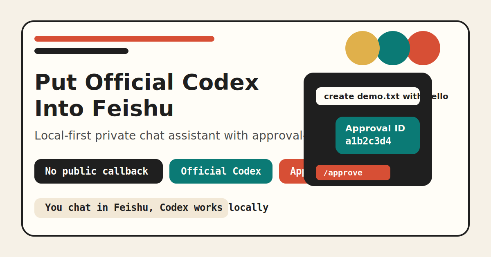

# Codex Claw

> Put official Codex into Feishu private chat, with approval-gated local control.


一个运行在本机的飞书私聊机器人，底层直接调用官方 Codex。

它不是再造一个 agent loop，而是把你已经能在桌面版 Codex 里做的事，接进飞书私聊，并补上审批、安全默认和持久化会话。

## 为什么这个项目值得点开

- 官方 Codex 做大脑，不是自己拼一个不稳定的 agent。
- 飞书私聊直接可用，不需要公网回调，不需要 `ngrok`。
- 文件改动、命令执行、进程控制先审批，再落地到本机。
- 支持自然语言定时任务、skill 查看与安装、会话持久化。
- 默认是安全工作区模式，不把“整机全权限”当成出厂默认。

## 30 秒理解它

你在飞书里发：

```text
帮我看看当前工作目录里有什么文件
```

机器人会直接检查本机并回复。

你再发：

```text
帮我创建一个 demo.txt，内容是 hello
```

它不会直接写文件，而是先回你：

```text
审批编号: a1b2c3d4

我会在当前工作区创建 demo.txt，并写入 hello。
回复 /approve a1b2c3d4 继续，或 /reject a1b2c3d4 取消。
```

这就是 Codex Claw 的核心体验：

`飞书聊天入口 + 官方 Codex + 本机能力 + 人工审批`

## 安全默认

公开版本推荐用这组默认配置：

```env
CODEX_CONTROL_SCOPE=workspace
ALLOWED_OPEN_IDS=你的 open_id
WORKSPACE_ROOTS=C:\your-workspace\CodexClaw
```

这意味着：

- 默认只开放工作区范围。
- 高风险操作必须先审批。
- 不建议把 `ALLOWED_OPEN_IDS=*` 当正式配置。

如果你明确知道自己在做什么，也可以手动切到：

```env
CODEX_CONTROL_SCOPE=computer
```

这会把它变成更接近桌面版 Codex 的本机操作器，但这不是公开版本的安全默认。

## 数据会去哪里

- 飞书消息会经过飞书平台。
- Codex 请求和回复会经过官方 Codex / OpenAI。
- 项目本身不会额外把数据上传到其它第三方。
- 本地默认只保存最小必要状态：会话映射、审批状态、送达状态、必要审计事件。

## 快速开始

### 1. 先让本机 Codex 可用

```powershell
npx codex login
```

### 2. 复制配置

```powershell
Copy-Item .env.example .env
```

第一次先只改这几项：

```env
FEISHU_APP_ID=你的 App ID
FEISHU_APP_SECRET=你的 App Secret
ALLOWED_OPEN_IDS=你的 open_id
WORKSPACE_ROOTS=C:\your-workspace\CodexClaw
CODEX_CONTROL_SCOPE=workspace
```

### 3. 启动

```powershell
npm install
npm run build
npm start
```

### 4. 去飞书里私聊机器人

```text
你好
```

再试：

```text
帮我看看当前工作目录里有什么文件
```

完整中文安装教程见：

- [docs/SETUP_ZH.md](./docs/SETUP_ZH.md)

## 常用命令

```text
/status
/reset
/approve <id>
/reject <id>
```

## 定时任务

它现在支持：

- 每天固定时间执行
- 每周固定几天固定时间执行
- 每隔几小时执行一次
- 失败自动重试
- 保存运行历史
- 结果自动投递回飞书

命令式创建：

```text
/cron add 09:00 帮我总结当前工作目录里有什么变化
```

自然语言也能直接听懂：

```text
每天早上9点帮我总结当前工作目录里有什么变化
每周五下午6点帮我总结本周这个项目目录里的改动
每隔2小时帮我检查一次当前工作区风险
```

查看：

```text
/cron list
/cron history
/cron pause <id>
/cron resume <id>
/cron delete <id>
```

如果定时任务本身属于高风险操作，它仍然会先发审批号，不会静默自动执行。

## Skills

现在也支持在飞书里查看和安装 Codex skills。

查看本机已安装 skills：

```text
/skill list
帮我看看本机有哪些技能
```

查看官方可安装 skills：

```text
/skill list curated
/skill list experimental
帮我列一下官方 skill
```

安装官方 skill：

```text
/skill install playwright
给我装一个 playwright skill
```

安装 experimental skill：

```text
/skill install experimental imagegen
帮我安装 experimental imagegen skill
```

从 GitHub 链接安装：

```text
/skill install url https://github.com/openai/skills/tree/main/skills/.experimental/playwright-interactive
帮我安装这个 skill https://github.com/openai/skills/tree/main/skills/.experimental/playwright-interactive
```

为安全起见，skill 安装会先走审批。安装完成后建议重启桥接服务：

```powershell
npm run bridge:restart
```

## 一键发到 GitHub

### 先做发布前检查

```powershell
npm run github:check
```

### 再一键推送到你的 GitHub 仓库

先在 GitHub 网页上创建一个空仓库，然后执行：

```powershell
npm run github:publish -- https://github.com/你的用户名/你的仓库名.git
```

这个脚本会自动：

- 跑一遍构建和测试
- 扫描常见密钥和本机路径痕迹
- `git add .`
- 创建首个提交
- 设置 `origin`
- 推送到 `main`

如果你已经有远程仓库，也可以重复运行它，它会自动更新 `origin` 并继续推送。

## 本地开发

```powershell
npm install
npm run build
npm test
npm start
```

重启桥接服务：

```powershell
npm run bridge:restart
```

## 发布材料

- [docs/SETUP_ZH.md](./docs/SETUP_ZH.md)
- [docs/LAUNCH_COPY_ZH.md](./docs/LAUNCH_COPY_ZH.md)
- [docs/RELEASE_CHECKLIST_ZH.md](./docs/RELEASE_CHECKLIST_ZH.md)

## 适合谁

- 想把官方 Codex 接进飞书办公流的开发者。
- 想做本地优先、审批驱动的 AI 操作器原型的团队。
- 不想把“整机全权限”当默认，但又想保留本机能力的人。

## 不适合谁

- 想直接做群聊机器人、多租户 SaaS、网页控制台的人。
- 想做鼠标键盘、截图驱动、桌面 GUI 自动化的人。
- 不愿意处理本地权限边界和审批流程的人。

## 安全提醒

- 发布前先轮换飞书 `App Secret`。
- 不要把 `.env`、`data/`、`logs/`、`dist/` 提交到 GitHub。
- 录屏和截图前，确认没有本机路径、密钥、日志片段和个人账号信息。

## Roadmap

- 飞书群聊和更丰富的审批交互
- 更细粒度的权限与目录白名单
- 更强的 skill 显式调用与管理
- 桌面端历史索引同步

## License

[MIT](./LICENSE)
